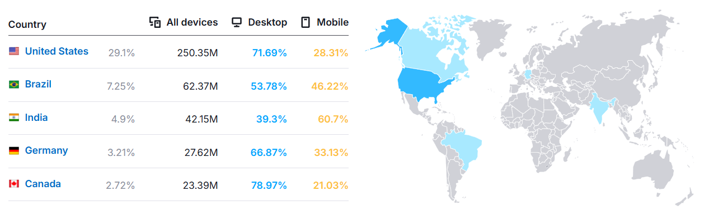

# Проектирование высоконагруженного аналога Discord

## Содержание
- [1. Тема и целевая аудитория](#1-тема-и-целевая-аудитория)
  - [Целевая аудитория](#целевая-аудитория)
  - [Функционал MVP](#функционал-mvp)
  - [Ключевые продуктовые решения](#ключевые-продуктовые-решения)
- [Список источников](#список-источников)

## 1. Тема и целевая аудитория
**Discord** - платформа для текстового и голосового общения в рамках пользовательских сообществ (серверов).

### Целевая аудитория
*   **MAU (Monthly Active Users):** 200 млн [^1].
*   **DAU (Daily Active Users):** 26.5 млн [^3].
*   **Количество зарегистрированных аккаунтов:** 560 млн [^2].
*   **География:** Глобальный рынок. Распределение трафика по данным на начало 2026 года [^4]:

| Страна | Доля трафика (%) | Оценка MAU (млн чел) |
| :--- | :--- | :--- |
| США | 29.1% | 58.2 |
| Бразилия | 7.25% | 14.5 |
| Индия | 4.9% | 9.8 |
| Германия | 3.2% | 6.4 |
| Канада | 2.7% | 5.4 |

 
*Распределение трафика по странам (Semrush) [^4]*

### Функционал MVP
Основной функционал заключается в создании иерархических сообществ и обеспечении каналов связи внутри них.

1.  **Управление серверами:** создание серверов и текстовых/голосовых каналов.
2.  **Текстовые чаты:** обмен сообщениями в реальном времени внутри каналов.
3.  **Голосовые каналы:** аудио-сессии для группового общения.
4.  **История сообщений:** хранение и доступ к переписке на стороне сервера.
5.  **Статусы:** статусы пользователей («в сети», «играет в...»).
6.  **Вложения (Media):** возможность загрузки изображений и файлов в текстовые каналы.

### Ключевые продуктовые решения
*   Голосовые каналы работают по модели «постоянной комнаты».
*   История сообщений хранится на серверах бессрочно и доступна с любого устройства в любой момент.
*   Синхронизация состояния серверов, сообщений и статусов между всеми активными сессиями пользователя.

## Список источников
[^1]: https://discord.com/company
[^2]: https://www.businessofapps.com/data/discord-statistics/
[^3]: https://www.demandsage.com/discord-statistics/
[^4]: https://www.semrush.com/website/discord.com/overview/
