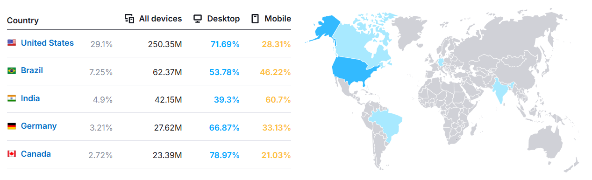
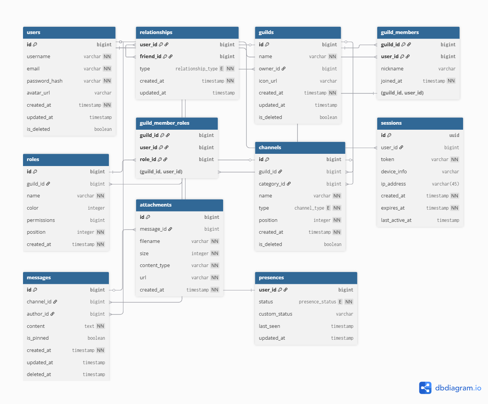
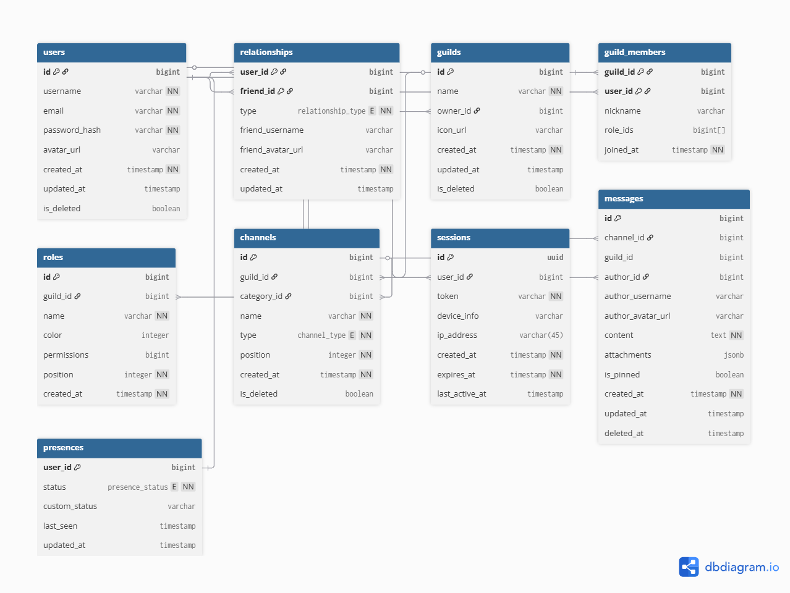

# Проектирование высоконагруженного аналога Discord

## Содержание
- [1. Тема и целевая аудитория](#1-тема-и-целевая-аудитория)
  - [Целевая аудитория](#целевая-аудитория)
  - [Функционал MVP](#функционал-mvp)
  - [Ключевые продуктовые решения](#ключевые-продуктовые-решения)
- [2. Расчет нагрузки](#2-расчет-нагрузки)
  - [Продуктовые метрики](#продуктовые-метрики)
  - [Технические метрики](#технические-метрики)
- [3. Глобальная балансировка нагрузки](#3-глобальная-балансировка-нагрузки)
  - [Функциональное разбиение по доменам](#функциональное-разбиение-по-доменам)
  - [Расположение ДЦ](#расположение-дц)
  - [Расчет распределения запросов по ДЦ](#расчет-распределения-запросов-по-дц)
  - [Схема DNS балансировки](#схема-dns-балансировки)
  - [Схема Anycast балансировки](#схема-anycast-балансировки)
  - [Механизм регулировки трафика между ДЦ](#механизм-регулировки-трафика-между-дц)
- [4. Локальная балансировка нагрузки](#4-локальная-балансировка-нагрузки)
  - [Схема балансировки нагрузки](#схема-балансировки-нагрузки)
  - [Расчет количества балансировщиков](#расчет-количества-балансировщиков)
- [5. Логическая схема БД](#5-логическая-схема-бд)
  - [Схема сущностей](#схема-сущностей)
  - [Описание таблиц и расчет размеров полей](#описание-таблиц-и-расчет-размеров-полей)
  - [Расчет суммарного объема данных](#расчет-суммарного-объема-данных)
  - [Нагрузка на таблицы (QPS)](#нагрузка-на-таблицы-qps)
  - [Требования к консистентности](#требования-к-консистентности)
  - [Особенности распределения нагрузки (Шардирование)](#особенности-распределения-нагрузки-шардирование)
- [6. Физическая схема БД](#6-физическая-схема-бд)
  - [Физическая диаграмма таблиц](#физическая-диаграмма-таблиц)
  - [Выбор СУБД, шардирование и резервирование](#выбор-субд-шардирование-и-резервирование)
  - [Денормализация данных](#денормализация-данных)
  - [Индексы](#индексы)
  - [Шардирование и Партиционирование](#шардирование-и-партиционирование)
  - [Резервирование](#резервирование)
  - [Клиентские библиотеки и интеграции](#клиентские-библиотеки-и-интеграции)
  - [Балансировка запросов и мультиплексирование](#балансировка-запросов-и-мультиплексирование)
  - [Схема резервного копирования](#схема-резервного-копирования)
- [Список источников](#список-источников)

## 1. Тема и целевая аудитория
**Discord** - платформа для текстового и голосового общения в рамках пользовательских сообществ (серверов).

### Целевая аудитория
*   **MAU (Monthly Active Users):** 200 млн [^1].
*   **DAU (Daily Active Users):** 26.5 млн [^3].
*   **Количество зарегистрированных аккаунтов:** 560 млн [^2].
*   **География:** Глобальный рынок. Распределение трафика по данным на начало 2026 года [^4]:

| Страна | Доля трафика (%) | Оценка MAU (млн чел) |
| :--- | :--- | :--- |
| США | 29.1% | 58.2 |
| Бразилия | 7.25% | 14.5 |
| Индия | 4.9% | 9.8 |
| Германия | 3.2% | 6.4 |
| Канада | 2.7% | 5.4 |

 
*Распределение трафика по странам (Semrush) [^4]*

### Функционал MVP
Основной функционал заключается в создании иерархических сообществ и обеспечении каналов связи внутри них.

1.  **Управление серверами:** создание серверов и текстовых/голосовых каналов.
2.  **Текстовые чаты:** обмен сообщениями в реальном времени внутри каналов.
3.  **Голосовые каналы:** аудио-сессии для группового общения.
4.  **История сообщений:** хранение и доступ к переписке на стороне сервера.
5.  **Статусы:** статусы пользователей («в сети», «играет в...»).
6.  **Вложения (Media):** возможность загрузки изображений и файлов в текстовые каналы.

### Ключевые продуктовые решения
*   Голосовые каналы работают по модели «постоянной комнаты».
*   История сообщений хранится на серверах бессрочно и доступна с любого устройства в любой момент.
*   Синхронизация состояния серверов, сообщений и статусов между всеми активными сессиями пользователя.

## 2. Расчет нагрузки

### Продуктовые метрики
Базовые показатели аудитории, на которые мы опираемся в расчетах:
*   **MAU (Monthly Active Users):** 200 млн [^1]
*   **DAU (Daily Active Users):** 26.5 млн [^3]
*   **Зарегистрированных аккаунтов:** 560 млн [^2]
*   **Активных серверов (Guilds):** 21 млн [^2]

**Средний размер хранилища пользователя**
Discord хранит более 1.5 триллиона сообщений [^5]. Среднее количество на аккаунт: `1.5 трлн / 560 млн ≈ 2678`.
*   *Текст:* Средний размер сообщения составляет ~250 байт [^10].
*   *Вложения:* Опираясь на статистику мессенджеров (WhatsApp [^12]), доля сообщений с медиа составляет ~12%. Для игрового чата примем оценку **10%**. Лимит загрузки для бесплатных пользователей - 10 МБ [^8], средний размер файла примем за 1 МБ.
*   *Профиль:* Аватар (~100 КБ) + настройки.

| Тип данных | Объем (шт) | Объем на 1 пользователя |
| :--- | :--- | :--- |
| Текстовые сообщения (история) | 2 678 | ~670 КБ (`2678 * 250 байт`) |
| Вложения (картинки, файлы) | 268 | ~268 МБ (`10% от сообщений * 1 МБ`) |
| Профиль | 1 | ~100 КБ |
| **Итого на пользователя** | | **~269 МБ** |

**Среднее количество действий пользователя в день**
1.  **Управление серверами**
    *   Лимит для бесплатного аккаунта - 100 серверов [^13]. Пользователи редко вступают в новые сервера или создают их. Примем частоту действия за 1 раз в неделю (0.14 в день).
2.  **Текстовые чаты (Отправка)**
    *   В день через платформу проходит **4 млрд сообщений** [^11]. В пересчете на активного пользователя: `4000 млн / 26.5 млн ≈ 150`.
    *   *Обоснование:* Цифра включает в себя сообщения от ботов и системные уведомления, которые инфраструктура обязана обработать и сохранить.
3.  **Голосовые каналы**
    *   Трафик составляет ~8 млрд минут в день (экстраполяция данных 2020 года [^6] на текущий MAU). На одного пользователя: `8000 млн / 26.5 млн ≈ 301 минута` (около 5 часов).
4.  **История сообщений (Чтение)**
    *   Пользователи открывают приложения мессенджеров в среднем 9 раз в день [^14].
    *   Согласно документации API Discord, при открытии канала клиент запрашивает пакет из **50 сообщений** по умолчанию [^15].
    *   Итого чтений (Loading): `9 сессий * 50 сообщений = 450 сообщений/день`.
5.  **Статусы и Fan-out**
    *   **Обоснование частоты (10 раз):** Складывается из сценария использования:
        1.  Вход/выход из приложения (2 события).
        2.  Игровая активность: согласно статистике [^16], средний геймер совершает **2.4 игровые сессии в день**. Каждая сессия генерирует статус "Начал играть" и "Закончил играть" (`2.4 * 2 ≈ 5` событий).
        3.  Переходы в режим "Не активен" (AFK) при перерывах (~3 события).
        4.  *Итог:* `2 + 5 + 3 = 10`.
    *   Учитывая архитектуру пассивных сессий [^9], сообщение доставляется не всем участникам сервера, а только активным. Примем эффективный fan-out = 20.
6.  **Вложения (Media)**
    *   Исходя из доли медиа-сообщений 10% [^12], пользователь загружает `150 * 0.1 = 15` файлов в день.

| Действие (MVP) | Количество в день | Обоснование |
| :--- | :--- | :--- |
| Управление серверами | 0.14 | 1 раз в неделю (лимит 100 серверов [^13]) |
| Отправка сообщений | 150 | Общая статистика (вкл. ботов) [^11] |
| Голосовая связь (минут) | 301 | Экстраполяция оф. данных [^6] |
| Чтение истории (сообщений) | 450 | 9 сессий [^14] * 50 msg limit [^15] |
| Смена статуса | 10 | Смена деятельности в течение дня |
| Загрузка вложений | 15 | 10% от отправленных сообщений [^12] |

### Технические метрики

**Обоснование пикового коэффициента (k = 1.5)**
Сервис является глобальным, поэтому нагрузка распределена по часовым поясам. Однако, согласно статистике трафика [^4], **~40%** аудитории сосредоточено в Северной и Южной Америке (США, Бразилия, Канада). Вечерний прайм-тайм этого макрорегиона создает основную волну нагрузки.
*   *Решение:* Используем коэффициент пиковой нагрузки **1.5**, так как остальные 60% трафика размазаны по Европе и Азии.

#### Размер хранилища
Discord хранит историю сообщений вечно. Расчет строится на накопленных данных (1.5 триллиона сообщений [^5]).

*   **Текстовые сообщения:** 1.5 трлн записей. Средний размер сжатого пейлоада - **250 байт** (по графику из инженерного блога [^10]).
*   **Медиа-вложения:** Согласно глобальной статистике мессенджеров (WhatsApp [^12]), доля сообщений с медиа составляет ~12%. Для игрового чата примем оценку **10%**.
    *   *Количество:* `1.5 трлн * 0.10 = 150 млрд файлов`.
    *   *Размер:* Лимит для бесплатных пользователей - 10 МБ [^8]. Средний размер файла (скриншоты, мемы) оценим в **1 МБ**.
*   **Метаданные серверов (Guilds):** 21 млн активных серверов [^2]. Храним роли, каналы, настройки. Средний размер объекта - 500 КБ.

| Тип данных | Количество (штук) | Расчет объема | Итоговый размер |
| :--- | :--- | :--- | :--- |
| **Текстовые сообщения** | 1.5 трлн | `1.5 * 10^11 * 250 байт` | **375 ТБ** |
| **Медиа-вложения** | 150 млрд | `150 * 10^9 * 1 МБ` | **150 ПБ** |
| **Профили пользователей** | 560 млн | `560 * 10^6 * 100 КБ` | **56 ТБ** |
| **Метаданные серверов** | 21 млн | `21 * 10^6 * 500 КБ` | **10.5 ТБ** |
| **Итого** | | | **~150.4 ПБ** |

#### Сетевой трафик
Расчет суточного и пикового потребления каналов связи.

*   **Голосовой трафик (Voice):**
    *   *Обоснование:* В 2020 году (100 млн MAU) трафик составлял 4 млрд минут/день [^6]. Экстраполируя на 200 млн MAU, получаем **8 млрд минут в день**.
    *   *Битрейт:* Стандартное качество - **64 kbps** (8 КБ/с) [^7].
*   **Медиа-трафик (CDN):**
    *   *Обоснование:* В сутки отправляется 4 млрд сообщений [^11]. 10% из них содержат файлы (400 млн файлов).
    *   *Объем:* `400 млн * 1 МБ = 400 ТБ` (загрузка). С учетом скачивания другими пользователями (Read factor ~3), суточный обмен ~1.2 ПБ.
*   **Текстовый Fan-out (WebSocket):**
    *   *Обоснование:* Сообщения доставляются через WebSocket. Благодаря архитектуре "пассивных сессий" [^9], сообщение не рассылается всем 1000 участникам сервера, а только тем, кто активен/смотрит экран. Примем эффективный **Fan-out = 20** (1 сообщение получают 20 человек).

| Тип трафика | Суммарный суточный (ГБ/сутки) | Средняя полоса (Гбит/с) | Пиковая полоса (Гбит/с) k=1.5 |
| :--- | :--- | :--- | :--- |
| **Голос (UDP)** | 3 840 000 | 355.5 | 533.3 |
| **Медиа (HTTP)** | 1 200 000 | 111.1 | 166.7 |
| **Fan-out (WS)** | 20 000 | 1.9 | 2.9 |
| **Итого** | **~5.06 ПБ/сут** | **~468.5 Гбит/с** | **~702.9 Гбит/с** |

#### RPS (Запросы в секунду)
Расчет нагрузки на бэкенд по типам запросов.
*   **Входящие сообщения (Write):** 4 млрд сообщений в сутки [^11].
    *   *Обоснование:* Эта цифра включает сообщения от ботов и системные уведомления.
*   **Чтение истории (Load History):**
    *   *Обоснование:* В среднем пользователь открывает приложение/меняет чат **9 раз в день** [^14].
    *   *Лимит:* По умолчанию API Discord запрашивает пакет из **50 сообщений** (`limit=50`) [^15].
    *   *Расчет:* `26.5 млн DAU * 9 сессий = 238.5 млн запросов`.
*   **Доставка (Push):** Работает через WebSocket push.
    *   *Расчет:* `Write RPS * Fan-out (20)`.

| Тип запроса | Обоснование расчета (сутки / 86400) | Средний RPS | Пиковый RPS (x1.5) |
| :--- | :--- | :--- | :--- |
| **Отправка сообщения** (Write) | `4 млрд / 86400` | 46 296 | 69 444 |
| **Доставка / Fan-out** (Push) | `Write RPS * 20` | 925 920 | 1 388 880 |
| **Загрузка истории** (Read API) | `(26.5 млн * 9) / 86400` | 2 760 | 4 140 |
| **Загрузка файлов** (Upload) | `10% от Write RPS` | 4 630 | 6 945 |
| **Обновление статуса** (Presence) | `(26.5 млн * 10) / 86400` | 3 067 | 4 600 |
| **Управление серверами** | `(26.5 млн * 0.14) / 86400` | 43 | 65 |

## 3. Глобальная балансировка нагрузки

### Функциональное разбиение по доменам
В целях изоляции различных типов трафика инфраструктура разбита на следующие домены:
*   `discord.com/api` - для обработки стандартных HTTP/REST запросов (авторизация, управление настройками профиля и серверов).
*   `gateway.discord.gg` - для поддержания постоянных WebSocket-соединений (Gateway). Обеспечивает передачу текстовых сообщений, статусов и сигналинга звонков в реальном времени.
*   `cdn.discordapp.com` - для первоначальной загрузки и хранения оригинальных пользовательских статических файлов и медиа-вложений.
*   `media.discordapp.net` - для отдачи оптимизированных медиа-файлов (ресайз изображений, генерация превью для видео). Выделение отдельного домена позволяет эффективно кэшировать производные форматы и экономить пропускную способность.
*   `*.discord.media` (например, `frankfurt.discord.media`) - домены голосовых серверов для маршрутизации UDP-трафика реального времени (WebRTC).

### Расположение ДЦ
Голосовая связь требует задержки (RTT) не более 50 мс. Поэтому инфраструктура размещена в 13 дата-центрах, выбранных с учетом пересечения подводных интернет-магистралей[^20] и доступа к надежным источникам электроэнергии [^21]. 

1.  **Северная Америка (4 ДЦ):** Ашберн (Восток), Чикаго (Центр), Лос-Анджелес (Запад), Майами (Юг). Выбраны из-за высокой доли аудитории (29.1%) и наличия главных магистральных узлов.
2.  **Европа (3 ДЦ):** Франкфурт, Лондон, Амстердам. Крупнейшие европейские точки обмена трафиком.
3.  **Азия (3 ДЦ):** Мумбаи, Сингапур, Токио. Основные кабельные хабы Азии и Юго-Восточной Азии.
4.  **Южная Америка (1 ДЦ):** Сан-Паулу. Обслуживает 7.25% глобальной аудитории (Бразилия) и является основным узлом высадки кабелей континента.
5.  **Океания (1 ДЦ):** Сидней. Необходим из-за географической изоляции региона.
6.  **Африка (1 ДЦ):** Йоханнесбург. Обусловлен необходимостью локального транзита медиа-трафика для Африки.

### Расчет распределения запросов по ДЦ
Каждый дата-центр рассчитан на обработку $1 / 13$ от глобального пикового трафика (общий пиковый RPS составляет 1 474 074). В регионах с повышенной плотностью пользователей запросы распределяются между несколькими локальными ДЦ, что выравнивает нагрузку.

| Регион | Количество ДЦ | Суммарный Пик RPS на регион | Пик RPS на 1 ДЦ | Суммарный Пик Трафика на регион (Гбит/с) | Пик Трафика на 1 ДЦ (Гбит/с) |
| :--- | :--- | :--- | :--- | :--- | :--- |
| Северная Америка | 4 | 453 560 | ~113 390 | 216.3 | ~54.07 |
| Европа | 3 | 340 170 | ~113 390 | 162.2 | ~54.07 |
| Азия | 3 | 340 170 | ~113 390 | 162.2 | ~54.07 |
| Южная Америка | 1 | 113 390 | 113 390 | 54.07 | 54.07 |
| Океания | 1 | 113 390 | 113 390 | 54.07 | 54.07 |
| Африка | 1 | 113 394 | 113 394 | 54.07 | 54.07 |
| **Итого** | **13** | **1 474 074** | | **702.9** | |

### Схема DNS балансировки
Используется Geo-based / Latency-based DNS для первичного направления пользователя в географически ближайший доступный дата-центр с минимальным RTT.

### Схема Anycast балансировки
Домены `api`, `gateway`, `cdn` и `media` работают поверх сети Cloudflare с использованием маршрутизации BGP Anycast[^19]. Один IP-адрес анонсируется из всех ДЦ, и запрос клиента маршрутизируется протоколом BGP на топологически ближайший сервер.

### Механизм регулировки трафика между ДЦ
Для передачи голосового UDP-трафика (WebRTC) Anycast не применяется, так как перестроение BGP-маршрутов может привести к обрыву потоковых сессий. Вместо этого используется Unicast-маршрутизация к конкретным серверам `*.discord.media`.

Механизм регулировки и перераспределения голосового трафика между ДЦ реализован через управляющий микросервис (`Discord Guilds`) и Service Discovery (`etcd`). Сервис непрерывно агрегирует метрики загруженности всех 13 дата-центров. В случае исчерпания ресурсов конкретного дата-центра или DDoS-атаки на него, управляющий сервис автоматически выбирает наименее загруженный ДЦ в регионе и отправляет клиентам команду (через Gateway) на установку нового UDP-соединения[^18].

## 4. Локальная балансировка нагрузки

### Схема балансировки нагрузки
Внутри каждого дата-центра маршрутизация запросов разделена на обработку внешнего (входящего) и внутреннего (межсервисного) трафика. 

**Уровни внешней балансировки:**
1.  **L4-балансировка (Транспортный уровень):** 
    В качестве единой точки входа используется Software Load Balancer **LVS (Linux Virtual Server)** в режиме **Virtual Server via Direct Routing (DR)**. 
    *   *Обоснование режима DR:* Весь обратный трафик (особенно тяжелый исходящий голосовой UDP-поток) идет от серверов к клиенту напрямую, минуя балансировщик. Это предотвращает перегрузку сети на самом балансировщике.
    *   *Маршрутизация:* Голосовой трафик (UDP) L4-балансировщик отправляет напрямую на bare-metal голосовые серверы (минуя L7). HTTP и WebSocket трафик (TCP) отправляется на слой L7-балансировщиков.
2.  **L7-балансировка (Прикладной уровень):**
    Используются серверы **NGINX**. Они осуществляют TCP multiplexing, поддерживают постоянные WebSocket-соединения и выполняют SSL Termination (расшифровку HTTPS). 
    *   *Оптимизация:* Для снижения нагрузки на CPU при SSL-хэндшейках применяются **Session tickets**. Расшифрованный трафик маршрутизируется на внутренние микросервисы.

**Механизмы резервирования:**
*   **L4 (LVS):** Используется схема резервирования **N * 2 (Active-Passive)**. Для мониторинга доступности нод и автоматического переключения IP-адресов в случае сбоя применяется демон `keepalived` (с использованием протокола VRRP).
*   **L7 (NGINX):** Используется схема резервирования **N + 1 (Active-Active)**. Все балансировщики работают одновременно, при падении одного из них трафик равномерно распределяется между оставшимися.

**Межсервисная (внутренняя) балансировка:**
Для маршрутизации внутреннего трафика между микросервисами применяется паттерн **L7 локальный на клиенте (Sidecar proxy)** на базе Envoy. Каждый микросервис имеет свой локальный прокси, который обеспечивает клиентскую балансировку, service discovery, ретраи и настройку таймаутов.

### Расчет количества балансировщиков
Расчет производится для одного дата-центра на основе пиковых показателей из Раздела 3:
*   Суммарный трафик на 1 ДЦ: **~54.06 Гбит/с**
*   Трафик L7 (HTTP + WS, без голоса): **~13.04 Гбит/с**
*   Пиковый RPS L7 (HTTP + WS): **~113 390 RPS**

**Эталонные показатели сервера (согласно бенчмаркам NGINX):**
Сервер на базе 16 CPU с включенным Hyper-Threading и сетевой картой 10GbE обеспечивает:
*   Пропускная способность (HTTP Throughput): **8.8 Гбит/с**
*   Терминация SSL (SSL TPS для RSA 2K): **56 715 соединений в секунду**

**1. Расчет балансировщиков L7 (NGINX):**
Ограничителями для L7 выступают терминация SSL и пропускная способность сети.
*   *По ограничению SSL:* $113 390 \text{ RPS} / 56 715 \text{ TPS} = 1.99 \rightarrow \text{2 сервера}$. (Расчет взят с запасом, так как благодаря Session tickets и постоянным WebSocket-соединениям реальное количество *новых* TLS-хэндшейков ниже общего RPS).
*   *По пропускной способности:* $13.04 \text{ Гбит/с} / 8.8 \text{ Гбит/с} = 1.48 \rightarrow \text{2 сервера}$.
*   *Итог для L7:* По обоим ограничителям требуется 2 активных сервера. Применяем формулу резервирования **N + 1**: $2 + 1 = \mathbf{3}$ **сервера NGINX на один ДЦ**.

**2. Расчет балансировщиков L4 (LVS):**
Ограничителем для L4 выступает только пропускная способность сетевых интерфейсов, так как SSL-терминация не выполняется. Для L4 серверов используются сетевые карты 40GbE.
*   *По пропускной способности:* $54.06 \text{ Гбит/с} / 40 \text{ Гбит/с} = 1.35 \rightarrow \text{2 сервера}$.
*   *Итог для L4:* Требуется 2 активных сервера. Применяем формулу резервирования **N * 2**: $2 \times 2 = \mathbf{4}$ **сервера LVS на один ДЦ**.

## 5. Логическая схема БД

В основе системы лежат **Snowflake ID** (64-битные целые числа). Это позволяет генерировать уникальные идентификаторы без обращения к централизованной базе данных, сохранять хронологический порядок записей по самому первичному ключу и эффективно масштабировать хранилище.

### Схема сущностей

### Описание таблиц и расчет размеров полей
Для расчетов принято: Snowflake ID = 8 байт, Timestamp = 8 байт, Boolean/Enum = 1 байт, Varchar/TEXT (среднее) = 100 байт.

| Таблица | Поле | Тип данных | Размер (байт) | Описание |
| :--- | :--- | :--- | :--- | :--- |
| **users** | id | BigInt | 8 | Snowflake ID (PK) |
| | username, email, password_hash, avatar_url | 4 x Varchar | 400 | Данные профиля |
| | created_at, updated_at | 2 x Timestamp | 16 | Временные метки |
| | is_deleted | Boolean | 1 | Мягкое удаление |
| **Итого строка:** | | | **425** | |
| **relationships**| user_id, friend_id | 2 x BigInt | 16 | Участники связи |
| | type | Enum | 1 | FRIEND/PENDING/BLOCKED |
| | created_at, updated_at | 2 x Timestamp | 16 | Время создания/правки |
| **Итого строка:** | | | **33** | |
| **guilds** | id, owner_id | 2 x BigInt | 16 | ID сервера и владельца |
| | name, icon_url | 2 x Varchar | 200 | Метаданные сервера |
| | created_at, updated_at | 2 x Timestamp | 16 | Временные метки |
| | is_deleted | Boolean | 1 | Статус удаления |
| **Итого строка:** | | | **233** | |
| **guild_members**| guild_id, user_id | 2 x BigInt | 16 | Составной ключ (FK) |
| | nickname | Varchar | 100 | Локальный никнейм |
| | joined_at | Timestamp | 8 | Дата вступления |
| **Итого строка:** | | | **124** | |
| **channels** | id, guild_id, category_id | 3 x BigInt | 24 | ID и вложенность в категорию |
| | name | Varchar | 100 | Имя канала |
| | type | Enum | 1 | TEXT/VOICE/CATEGORY |
| | position | Integer | 4 | Порядок в списке |
| | created_at | Timestamp | 8 | Дата создания |
| **Итого строка:** | | | **137** | |
| **sessions** | id | UUID | 16 | Уникальный ID (хронология не нужна) |
| | user_id | BigInt | 8 | Владелец сессии |
| | token, device_info | 2 x Varchar | 200 | Токен и данные об устройстве |
| | ip_address | Varchar(45) | 45 | IPv4/IPv6 адрес |
| | created_at, expires_at, last_active_at | 3 x Timestamp | 24 | Временные метки сессии |
| **Итого строка:** | | | **293** | |
| **messages** | id, channel_id, author_id | 3 x BigInt | 24 | Snowflake ID и FK |
| | content | TEXT | 100 | Содержимое сообщения |
| | is_pinned | Boolean | 1 | Флаг закрепа |
| | created_at, updated_at, deleted_at | 3 x Timestamp | 24 | Метки (вкл. удаление) |
| **Итого строка:** | | | **149** | |
| **attachments** | id, message_id | 2 x BigInt | 16 | ID файла и сообщения |
| | filename, url | 2 x Varchar | 200 | Путь в CDN и имя |
| | size | BigInt | 8 | Размер в байтах |
| | created_at | Timestamp | 8 | Время загрузки |
| **Итого строка:** | | | **232** | |
| **presences** | user_id | BigInt | 8 | ID пользователя (FK) |
| | status | Enum | 1 | ONLINE/IDLE/DND... |
| | custom_status | Varchar | 100 | Текст статуса |
| | last_seen, updated_at | 2 x Timestamp | 16 | Время активности |
| **Итого строка:** | | | **125** | |

### Расчет суммарного объема данных

| Таблица | Кол-во записей | Обоснование кол-ва записей | Расчет объема | Итого (ТБ) |
| :--- | :--- | :--- | :--- | :--- |
| **users** | 560 млн | Общее число аккаунтов | `560 * 10^6 * 425` | 0.22 |
| **relationships** | 11.2 млрд | 20 друзей на юзера (среднее) | `11.2 * 10^9 * 33` | 0.34 |
| **guilds** | 21 млн | Активные серверы | `21 * 10^6 * 233` | 0.004 |
| **guild_members**| 11.2 млрд | 20 серверов на юзера | `11.2 * 10^9 * 124` | 1.29 |
| **channels** | 210 млн | 10 каналов на 1 сервер | `210 * 10^6 * 137` | 0.03 |
| **messages** | 1.5 трлн | Вся история сообщений | `1.5 * 10^12 * 149` | 203.27 |
| **attachments** | 150 млрд | 10% от всех сообщений | `150 * 10^9 * 232` | 32.37 |
| **presences** | 560 млн | По одной записи на юзера | `560 * 10^6 * 125` | 0.06 |
| **sessions** | 80 млн | ~3 активных устройства на 1 DAU | `80 * 10^6 * 293` | 0.02 |
| **Итого:** | | | | **~237.6 ТБ** |

### Нагрузка на таблицы (QPS)
Показатели QPS выведены из продуктовых метрик Раздела 2.

| Таблица | Пиковая нагрузка (Write QPS) | Обоснование (формула) | Пиковая нагрузка (Read QPS) | Обоснование (формула) |
| :--- | :--- | :--- | :--- | :--- |
| **messages** | 69 444 | Пик RPS отправки сообщений | 4 140 | Пик RPS загрузки истории |
| **presences** | 4 600 | Пик RPS смены статуса | 1 388 880 | Пик RPS доставки (Fan-out) |
| **attachments** | 6 945 | Пик RPS загрузки вложений | 20 835 | Write RPS * Read factor (3) |
| **users** | 10 | Регистрации/Правки профиля | 1 500 | Запросы профиля при сессиях |
| **guild_members**| 65 | Пик RPS управления серверами | 6 000 | Проверка прав при действиях |
| **sessions** | 700 | `DAU * 1.5 / 86400 * 1.5` (логины) | 120 000 | Сумма API RPS (проверка токена) |

### Требования к консистентности

**Строгая консистентность (Strict Consistency):**
Ограничивается исключительно критическими узлами, связанными с безопасностью аккаунтов, чтобы избежать дорогостоящих распределенных блокировок:
*   `users` - смена пароля или привязка почты должна применяться немедленно.
*   `sessions` - при отзыве токена (нажатие "Выйти со всех устройств") доступ должен прекращаться мгновенно во всех дата-центрах для защиты от компрометации.

**Согласованность в конечном счете (Eventual Consistency):**
Применяется для абсолютного большинства данных системы. В условиях глобально распределенной архитектуры задержка репликации в 1-2 секунды является допустимой платой за высокую доступность и низкий latency (согласно теореме CAP):
*   `messages` и `attachments` - небольшая задержка при доставке сообщения другим участникам.
*   `presences` - статусы друзей могут обновляться асинхронно.
*   `guild_members` и `roles` - если пользователю выдали новую роль или он вступил на сервер, задержка применения этих прав в 1-2 секунды не влияет на UX, но позволяет снять оверхед с базы данных.
*   `relationships` - принятие заявки в друзья или блокировка пользователя также могут реплицироваться в фоне.

### Особенности распределения нагрузки (Шардирование)
1.  **messages:** Основной ключ шардирования - `channel_id`. Это обеспечивает высокую локальность данных: сообщения одного канала физически находятся в одном шарде, что позволяет эффективно выбирать историю последних 50 сообщений без сканирования всей базы.
2.  **users и presences:** Шардируются по `user_id`. Это равномерно распределяет запросы на авторизацию и обновление статусов по узлам кластера.
3.  **guild_members:** Шардирование по `guild_id`. Необходимо для быстрой рассылки уведомлений всем участникам конкретного сервера при публикации сообщения.
4.  **sessions:** Шардирование по `token` (или его хэшу). Это обеспечивает максимально быстрое чтение и проверку прав доступа (auth middleware) при каждом входящем HTTP/WebSocket запросе, равномерно размазывая нагрузку (120 000 QPS) по кластеру in-memory БД.

## 6. Физическая схема БД

Физическая схема разработана для обеспечения горизонтального масштабирования и исключения межсерверных JOIN-запросов. Хранилище разделено на три сегмента: реляционный (PostgreSQL) для метаданных, NoSQL (MongoDB) для тяжелых логов сообщений и In-memory (Redis) для высоконагруженных данных в реальном времени.

### Физическая диаграмма таблиц

### Выбор СУБД, шардирование и резервирование

| Таблица | СУБД | Ключ шардирования | Резервирование | Обоснование выбора |
| :--- | :--- | :--- | :--- | :--- |
| **users** | PostgreSQL | `id` (hash) | Master-Slave | Нужна строгая транзакционность (ACID) для авторизации и поддержка уникальных индексов. |
| **guilds** | PostgreSQL | `id` (hash) | Master-Slave | Реляционная структура для хранения метаданных и настроек серверов. |
| **guild_members** | PostgreSQL | `guild_id` | Master-Slave | Требуется поддержка массивов (`bigint[]`) для денормализованного хранения ролей. |
| **roles** | PostgreSQL | `guild_id` | Master-Slave | Данные имеют четкую структуру и малый объем; хранятся совместно с гильдиями. |
| **channels** | PostgreSQL | `guild_id` | Master-Slave | Позволяет реализовать иерархию через self-reference и обеспечить локальность данных сервера. |
| **messages** | MongoDB | `channel_id` | Replica Set | **203 ТБ данных.** NoSQL эффективнее масштабируется при больших объемах и высокой нагрузке на запись (46к QPS). |
| **attachments** | MongoDB | `channel_id` | Replica Set | Обеспечивает локальность данных с сообщениями для чтения истории без JOIN. |
| **relationships** | MongoDB | `user_id` | Replica Set | Масштабируемое хранилище для социального графа объемом 0.34 ТБ. |
| **sessions** | Redis | `token` (hash) | Master-Slave | **120к QPS на чтение.** Требуется минимальная задержка (Latency) при проверке авторизации. |
| **presences** | Redis | `user_id` | Master-Slave | **1.3 млн QPS.** Единственный тип СУБД, способный обработать такую нагрузку на чтение при Fan-out. |

### Обоснование конфигураций

1.  **PostgreSQL (Metadata):** Используется для данных, объем которых не превышает 2 ТБ (аккаунты, серверы, роли). Шардирование по `id` или `guild_id` позволяет распределить нагрузку на CPU. Резервирование Master-Slave обеспечивает отказоустойчивость.
2.  **MongoDB (History):** Выбрана для хранения 1.5 трлн сообщений. Документоориентированная модель позволяет легко расширять схему (например, добавлять типы вложений) и линейно масштабировать кластер добавлением новых шардов. Ключ `channel_id` гарантирует, что история одного канала не разрывается между серверами.
3.  **Redis (Real-time):** Используется для данных с временем жизни (TTL) или экстремально высокой частотой обновления. Все данные умещаются в RAM (60-80 ГБ), что позволяет обрабатывать свыше 1 млн запросов в секунду.

### Денормализация данных

Денормализация применена для исключения кросс-шардовых JOIN-операций, которые недопустимы при высоких нагрузках (4 млрд сообщений/день).

| Таблица | Денормализованные поля | Обоснование (отказ от JOIN) |
| :--- | :--- | :--- |
| **relationships** | `friend_username`, `friend_avatar_url` | Позволяет отрисовать список друзей одним запросом к таблице связей, не обращаясь к таблице `users`. |
| **guild_members** | `role_ids` (bigint[]) | Позволяет бэкенду мгновенно получить список ролей участника. Права ролей берутся из кэша (Redis) по этим ID. |
| **messages** | `guild_id` | Позволяет быстро фильтровать сообщения по серверу и маршрутизировать события в Gateway без обращения к таблице каналов. |
| **attachments** | `channel_id` | Обеспечивает локализацию данных: метаданные файлов физически лежат в том же шарде, что и сообщения канала. |

### Индексы

Индексы подобраны исходя из типов запросов (OLTP). Использованы **Hash-индексы** для точечного поиска (O(1)) и **B-Tree** для поиска по диапазонам и сортировки (O(log N)).

| Таблица | Поле | Тип индекса | Обоснование |
| :--- | :--- | :--- | :--- |
| **users** | `id` | Primary Key (B-Tree) | Поиск профиля по Snowflake ID. |
| | `email` | Hash | Уникальный поиск при авторизации (только точное совпадение). |
| | `username` | B-Tree | Поиск пользователей по никнейму (поддержка поиска по префиксу). |
| **relationships**| `(user_id, friend_id)` | **Composite PK** | Гарантия уникальности связи и быстрый поиск конкретного друга. |
| | `user_id` | Hash | Быстрая выборка всего списка друзей пользователя (Shard Key). |
| **guild_members**| `(guild_id, user_id)` | **Composite PK** | Гарантия уникальности членства на сервере. |
| | `user_id` | B-Tree | Поиск списка всех серверов, на которых состоит пользователь. |
| **roles** | `guild_id` | Hash | Быстрая выборка всех ролей конкретного сервера. |
| **guild_member_roles** | `(guild_id, user_id, role_id)` | **Composite PK** | Ускорение административных проверок и поиска по ролям. |
| **channels** | `guild_id` | Hash | Получение структуры каналов сервера за один запрос. |
| **sessions** | `token` | Hash | Мгновенная проверка авторизации по токену в каждом API-запросе. |
| | `user_id` | B-Tree | Поиск всех активных сессий пользователя (для функции "Выйти на всех устройствах"). |
| **messages** | `id` | Primary Key (B-Tree) | Доступ к конкретному сообщению по ссылке. |
| | `(channel_id, id)` | **Composite B-Tree** | **Критический индекс:** мгновенное чтение истории чата (`ORDER BY id DESC LIMIT 50`). |
| | `author_id` | B-Tree | Поиск всех сообщений конкретного автора (для модерации/фильтрации). |
| **attachments** | `message_id` | Hash | Быстрая склейка метаданных файлов с сообщением на уровне приложения. |
| **presences** | `user_id` | Primary Key (Hash) | Точечное обновление и чтение статуса пользователя. |

### Шардирование и Партиционирование

1. **Шардирование (Sharding):**
   * **По идентификатору (Hash-based):** Применяется для таблиц `users`, `guilds`, `sessions`, `presences`. Обеспечивает равномерное распределение нагрузки по узлам.
   * **По функциональному признаку (Entity-based):** 
     * `guild_members`, `channels`, `roles` - шардируются по `guild_id`. Все метаданные сервера всегда находятся на одном физическом шарде.
     * `messages`, `attachments` - шардируются по `channel_id`. История переписки канала всегда локализована на одном узле.

2. **Партиционирование (Partitioning):**
   * Применяется для таблицы **messages** внутри каждого шарда. 
   * **Тип:** Range Partitioning по полю `id` (Snowflake ID). 
   * **Зачем:** Поскольку Snowflake ID содержит в себе временную метку, это позволяет базе данных быстро отсекать старые данные и эффективно управлять дисковым пространством (например, перемещать партиции за прошлые годы на медленные HDD).

### Резервирование

Для каждой СУБД выбрана схема горячего резервирования для исключения единой точки отказа:

* **PostgreSQL:** Классическая схема **Master-Slave** с асинхронной репликацией. Запись идет в Master, чтение (там, где допустим задержка - например, профили) - со Slave.
* **MongoDB:** Использование **Replica Set** (1 Primary + 2 Secondary). Обеспечивает автоматическое переключение при отказе узла. Реплики распределяются между разными стойками в дата-центре.
* **Redis:** Схема **Master-Slave + Sentinel**. Sentinel отслеживает состояние узлов и автоматически назначает нового мастера при сбое.

### Клиентские библиотеки и интеграции

Для работы с распределенными СУБД на уровне приложения (написанного на Go/C++) используются высокопроизводительные драйверы с поддержкой пулов соединений:

*   **PostgreSQL:** Библиотека `pgx` (Go). Поддерживает эффективную работу с типами данных Postgres и автоматическую подготовку стейтментов.
*   **MongoDB:** Официальный `mongo-go-driver`. Используется для асинхронной записи сообщений и вложений.
*   **Redis:** Библиотека `go-redis`. Поддерживает работу с Redis Sentinel для автоматического переключения на Slave-узлы при сбоях.
*   **Kafka (Шина событий):** Библиотека `confluent-kafka-go`. Используется как промежуточный буфер для входящего потока сообщений перед их записью в MongoDB, а также для передачи событий Presence (статусов).

### Балансировка запросов и мультиплексирование

1.  **PostgreSQL (pgBouncer):** Перед каждым шардом Postgres устанавливается **pgBouncer**. Он выполняет **мультиплексирование соединений**: тысячи соединений от бэкенд-сервисов превращаются в десятки стабильных соединений к самой БД. Это экономит до 30-40% ресурсов CPU сервера базы.
2.  **MongoDB:** Балансировка осуществляется через встроенный компонент **Mongos**. Он принимает запрос от приложения, определяет нужный шард по `channel_id` и маршрутизирует запрос.
3.  **Redis:** Балансировка чтения распределяется между Master и Slave узлами на уровне клиентской библиотеки (Client-side balancing).

### Схема резервного копирования

Резервное копирование разделено по типам данных для минимизации нагрузки на дисковую подсистему:

*   **PostgreSQL (Metadata):** 
    *   Ежедневный полный бэкап (Full Dump) со Slave-сервера.
    *   Непрерывное архивирование **WAL-логов** (Write Ahead Log) в удаленное объектное хранилище (S3) для возможности восстановления на любой момент времени (Point-in-Time Recovery).
*   **MongoDB (Messages):** 
    *   Учитывая объем 200+ ТБ, полный дамп нецелесообразен. Используется создание **Snapshot-ов** на уровне файловой системы (LVM/EBS) с Replica-узлов. 
    *   Бэкапы делаются распределенно: каждый шард делает бэкап своей части данных.
*   **Redis (Sessions/Presence):**
    *   Для сессий включен механизм **AOF (Append Only File)** с синхронизацией каждую секунду. 
    *   Раз в час создается **RDB-снапшот** (бинарный дамп всей памяти) для быстрого прогрева кэша после перезагрузки.

## Список источников
[^1]: https://discord.com/company
[^2]: https://www.businessofapps.com/data/discord-statistics/
[^3]: https://www.demandsage.com/discord-statistics/
[^4]: https://www.semrush.com/website/discord.com/overview/
[^5]: https://discord.com/blog/how-discord-indexes-trillions-of-messages
[^6]: https://discord.com/blog/your-place-to-talk
[^7]: https://support.discord.com/hc/en-us/articles/11635925354775-Audio-Bitrate-FAQ
[^8]: https://support.discord.com/hc/en-us/articles/203776035-Uploading-images-videos-and-other-files
[^9]: https://discord.com/blog/maxjourney-pushing-discords-limits-with-a-million-plus-online-users-in-a-single-server
[^10]: https://discord.com/blog/how-discord-reduced-websocket-traffic-by-40-percent
[^11]: https://discord.com/blog/how-discord-supercharges-network-disks-for-extreme-low-latency
[^12]: https://www.infobip.com/blog/whatsapp-statistics
[^13]: https://enozom.com/blog/how-to-create-discord-account-on-mobile/
[^14]: https://www.cio.com/article/246540/messaging-app-usage-retention-rates-dwarf-all-other-apps.html
[^15]: https://discord.com/developers/docs/resources/channel#get-channel-messages
[^16]: https://icon-era.com/statistics/average-gaming-session-length-by-age-group/
[^17]: https://discord.com/blog/how-discord-reduced-websocket-traffic-by-40-percent
[^18]: https://discord.com/blog/how-discord-handles-two-and-half-million-concurrent-voice-users-using-webrtc
[^19]: https://www.cloudflare.com/ru-ru/case-studies/discord/
[^20]: https://www.submarinecablemap.com/
[^21]: https://globalenergymonitor.org/projects/global-nuclear-power-tracker/tracker-map/
